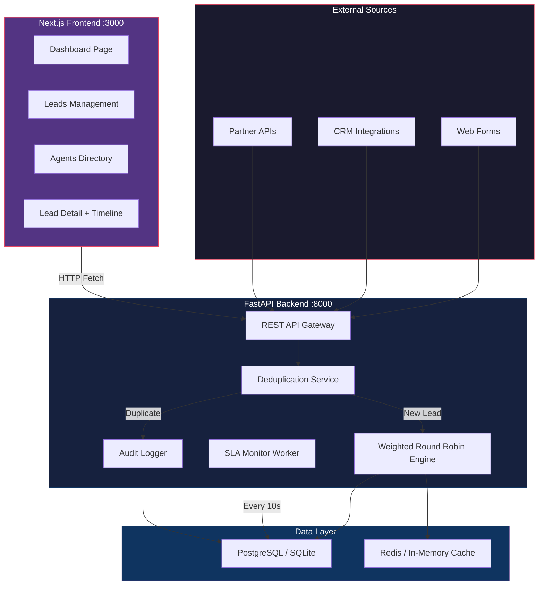
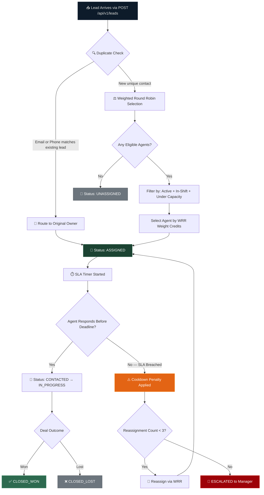
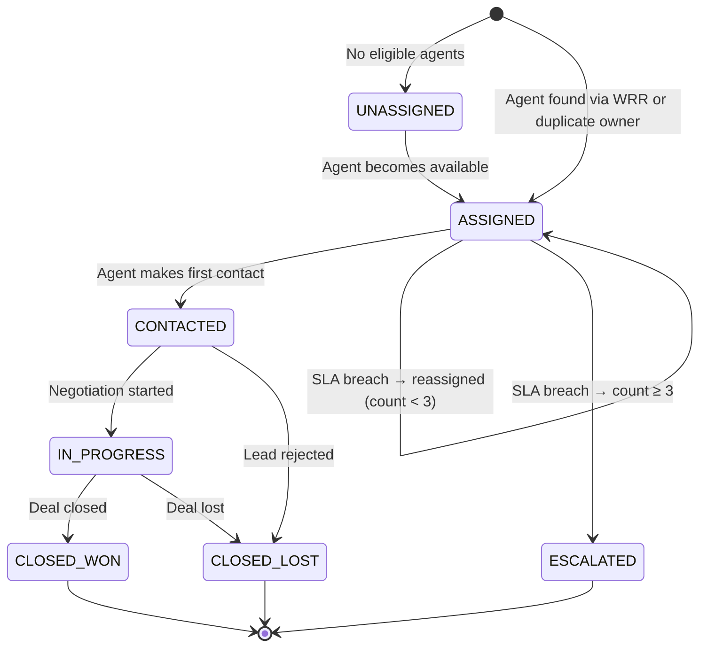
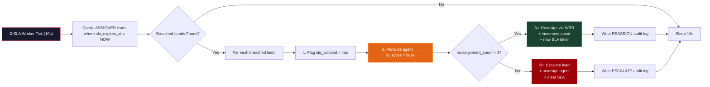
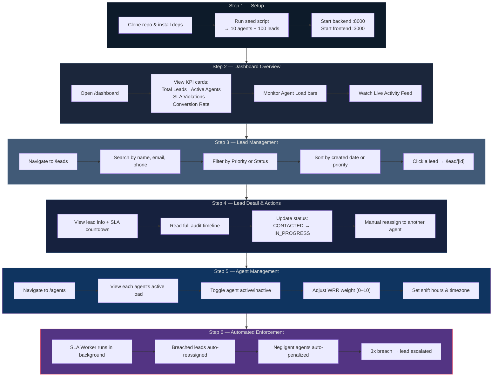
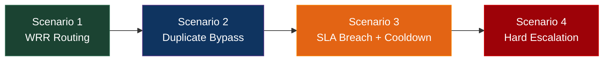

# LeadFlow

## Automated Real-Time Sales Lead Distribution Platform

LeadFlow is a production-grade lead routing engine that ingests inbound sales leads, deduplicates contacts, assigns them to agents via a stateful Weighted Round Robin algorithm, enforces SLA deadlines with automatic cooldown penalties, and serves operational metrics through a modern Next.js dashboard.

---

## Table of Contents

- [Architecture Overview](#architecture-overview)
- [System Workflow](#system-workflow)
- [Lead Lifecycle](#lead-lifecycle)
- [SLA Enforcement Flow](#sla-enforcement-flow)
- [User Journey — Step by Step](#user-journey--step-by-step)
- [Quick Start](#quick-start)
- [API Reference](#api-reference)
- [Automated Scenario Validation](#automated-scenario-validation)
- [Project Structure](#project-structure)
- [Production Stack (Optional)](#production-stack-optional)

---

## Architecture Overview



---

## System Workflow

This is the end-to-end flow from when a lead enters the system to when it reaches a terminal state.



---

## Lead Lifecycle

Every lead transitions through a defined set of states. The diagram below shows every valid transition.



---

## SLA Enforcement Flow

A background worker runs every **10 seconds** scanning for assigned leads past their SLA deadline.



### SLA Deadlines by Priority

| Priority | Response Deadline |
| -------- | ----------------- |
| **HIGH** | 15 minutes |
| **MEDIUM** | 60 minutes |
| **LOW** | 24 hours |

---

## User Journey — Step by Step

This is how a user interacts with LeadFlow from initial setup through daily operations.



---

## Quick Start

> **Zero-config mode**: No PostgreSQL or Redis required. The backend auto-detects and falls back to SQLite and in-memory cache.

### Prerequisites

| Requirement | Minimum Version |
| ----------- | --------------- |
| Python | 3.11+ |
| Node.js | 18+ |
| Git | 2.x |

### 1. Clone & Install

```bash
git clone https://github.com/vanrajsinh650/LeadFlow.git
cd LeadFlow

# Backend
pip install -r backend/requirements.txt

# Frontend
cd frontend && npm install && cd ..
```

### 2. Seed the Database

```bash
python scripts/seed_db.py
```

This populates the database with **10 realistic sales agents** and **100 sample leads** with randomized priorities, statuses, and sources.

### 3. Start the Backend

```bash
python -m uvicorn backend.app.main:app --port 8000 --reload
```

The API starts at `http://localhost:8000`. The SLA background worker begins monitoring automatically.

### 4. Start the Frontend

```bash
cd frontend
npm run dev
```

Open `http://localhost:3000` in your browser.

### 5. Explore the Pages

| Page | URL | Purpose |
| ---- | --- | ------- |
| **Dashboard** | `/dashboard` | KPI cards, agent capacity bars, live activity feed |
| **Leads** | `/leads` | Searchable, filterable, sortable lead table |
| **Lead Detail** | `/lead/[id]` | Full timeline, status updates, manual reassignment |
| **Agents** | `/agents` | Agent directory, toggle availability, adjust weights |

---

## API Reference

### Leads

| Method | Endpoint | Description |
| ------ | -------- | ----------- |
| `GET` | `/api/v1/leads` | List leads with search, filter, sort, pagination |
| `POST` | `/api/v1/leads` | Ingest a new lead (triggers dedup + WRR routing) |
| `GET` | `/api/v1/leads/{id}` | Get lead detail with audit log timeline |
| `PATCH` | `/api/v1/leads/{id}/status` | Update lead status (stops SLA clock on contact) |
| `POST` | `/api/v1/leads/{id}/reassign` | Manual reassignment with capacity validation |

### Agents

| Method | Endpoint | Description |
| ------ | -------- | ----------- |
| `GET` | `/api/v1/agents` | List all agents with current load counts |
| `PATCH` | `/api/v1/agents/{id}/routing-config` | Update weight, availability, shift, capacity |

### Dashboard

| Method | Endpoint | Description |
| ------ | -------- | ----------- |
| `GET` | `/api/v1/dashboard/stats` | Aggregate KPIs, agent loads, and activity feed |

### Interactive Docs

Once the backend is running, visit:

- **Swagger UI**: [http://localhost:8000/docs](http://localhost:8000/docs)
- **ReDoc**: [http://localhost:8000/redoc](http://localhost:8000/redoc)

---

## Automated Scenario Validation

Run all 4 business-rule scenarios end-to-end:

```bash
python scripts/run_scenarios.py
```



| # | Scenario | What It Validates |
| - | -------- | ----------------- |
| 1 | **Weighted Round Robin Routing** | New lead → assigned to agent → SLA computed → INGEST audit logged |
| 2 | **Route to Owner Bypass** | Duplicate lead → bypasses WRR → routes to original owner agent |
| 3 | **SLA Breach & Cooldown** | SLA forced to past → worker detects → agent penalized → lead reassigned |
| 4 | **Hard Escalation Limit** | 3 reassignments exceeded → lead status = ESCALATED → agent unassigned |

---

## Project Structure

```text
LeadFlow/
├── backend/
│   ├── app/
│   │   ├── api/v1/           # REST endpoints (leads, agents, dashboard)
│   │   ├── core/             # Configuration and settings
│   │   ├── db/               # Database session, engine, fallback logic
│   │   ├── models/           # SQLAlchemy ORM models (Lead, Agent, User, Audit)
│   │   ├── schemas/          # Pydantic request/response schemas
│   │   ├── services/         # Business logic layer
│   │   │   ├── assignment_service.py    # Agent eligibility + WRR orchestration
│   │   │   ├── deduplication.py         # Email/phone duplicate detection
│   │   │   ├── sla.py                   # SLA breach monitor + cooldown engine
│   │   │   └── weighted_round_robin.py  # Stateful WRR algorithm
│   │   └── main.py           # FastAPI app + lifespan + SLA worker
│   └── requirements.txt
├── frontend/
│   ├── src/app/
│   │   ├── dashboard/        # KPI cards, agent bars, activity feed
│   │   ├── leads/            # Lead list with search/filter/sort
│   │   ├── lead/[id]/        # Lead detail with audit timeline
│   │   ├── agents/           # Agent directory with config controls
│   │   └── layout.tsx        # App shell with sidebar navigation
│   └── package.json
├── context/                  # Architecture decision records (12 files)
├── scripts/
│   ├── seed_db.py            # Database seeder (10 agents + 100 leads)
│   └── run_scenarios.py      # Automated integration test scenarios
├── docker/                   # Docker Compose for production stack
└── docs/                     # Documentation and demo assets
```

---

## Production Stack (Optional)

For full **PostgreSQL + Redis** deployment:

```bash
# Start infrastructure
docker-compose -f docker/docker-compose.yml up -d

# Seed PostgreSQL
python scripts/seed_db.py

# Start API (auto-detects containers)
python -m uvicorn backend.app.main:app --port 8000 --reload
```

The backend automatically detects available PostgreSQL and Redis containers and connects to them instead of the local fallbacks.

---

## Tech Stack

| Layer | Technology | Purpose |
| ----- | ---------- | ------- |
| **Backend** | FastAPI (Python 3.11+) | REST API, async I/O, background tasks |
| **Frontend** | Next.js 15 (React 19) | Dashboard, SSR, App Router |
| **Primary DB** | PostgreSQL / SQLite fallback | Relational data, audit logs |
| **Cache** | Redis / In-memory fallback | WRR routing state persistence |
| **ORM** | SQLAlchemy 2.0 (async) | Database abstraction layer |
| **Validation** | Pydantic v2 | Request/response schema enforcement |

---

## License

This project was built as a technical assessment submission.
