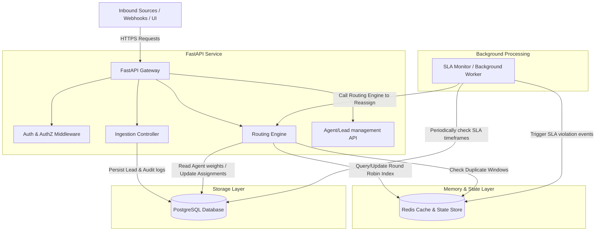
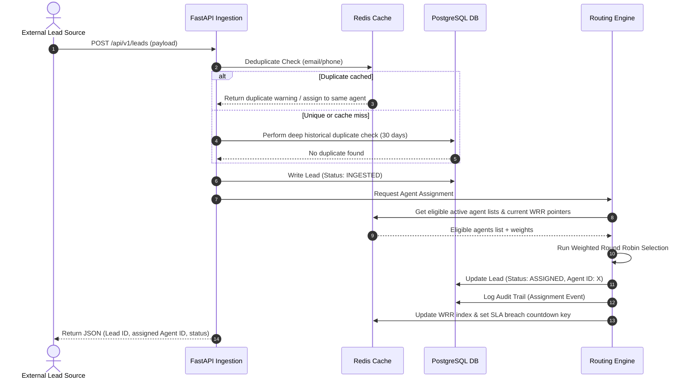

# 03-architecture.md - System Architecture

This is the Single Source of Truth (SSOT) for LeadFlow's system architecture, component boundaries, and data flow.

## 1. Component Diagram

---

## 2. Component Boundaries
LeadFlow is built as a modular monolith with clearly defined logical boundaries.

### FastAPI Application Layer
- **Ingestion Controller:** Exposes high-speed endpoints for webhook registration and manual lead creation. Handles parsing, schema validation, and normalization of inputs.
- **Routing Engine:** The core algorithm container. Inspects incoming leads, applies duplicate checking, filters active/available agents, computes Weighted Round Robin selections, and commits assignments.
- **Management API:** Standard CRUD endpoints for administrators/managers to manage agents (work shift, weights, status) and generate lead distribution reports.

### Memory & State Layer (Redis)
- **Weighted Round Robin state:** Keeps the active list of agents, the last distributed agent, and running weight quotas to make O(1) routing decisions.
- **Ingestion Deduplication Cache:** Stores SHA256 hashes of incoming phone numbers/emails for 5 minutes to intercept rapid-fire duplicate requests before hitting the database.
- **Locks:** Handles distributed locking (Redlock) during assignment to prevent race conditions where two threads route to the same agent simultaneously.

### Persistence Layer (PostgreSQL)
- Relational storage for users, agents, lead metadata, assignments, and audit trails.
- Enforces relational constraints (e.g., ensuring a lead can't reference a non-existent agent).
- B-Tree and GIN indexes optimized for rapid search on email, phone, and lead status.

### Background Workers / Schedulers
- Runs asynchronous check loops to identify leads whose SLA timers have expired without a status transition.
- Dispatches webhooks and pushes notifications to external communication channels.

---

## 3. Data Flow

### Scenario: Lead Ingestion & Assignment

---

## 4. Deployment Architecture
LeadFlow is designed to be cloud-native and highly available:
- **Application Nodes:** Containerized FastAPI applications running inside Docker/Kubernetes, scaling horizontally based on request volume.
- **Relational Store:** Multi-Availability-Zone PostgreSQL deployment with automatic failover and read replicas for analytical queries.
- **Caching Layer:** Redis Cluster (Primary + Replica) to guarantee low-latency lock execution and state maintenance.
- **Health Monitoring:** Health checks exposed at `/health` for Kubernetes Liveness and Readiness probes.
