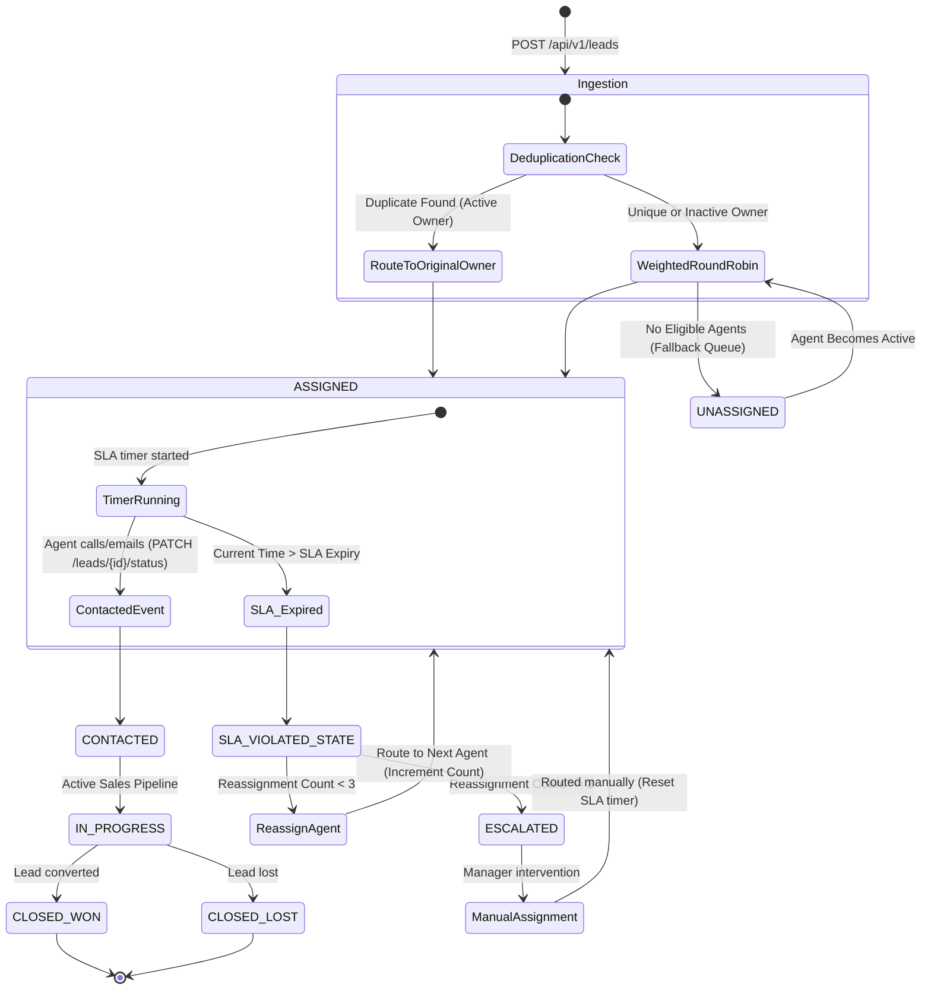
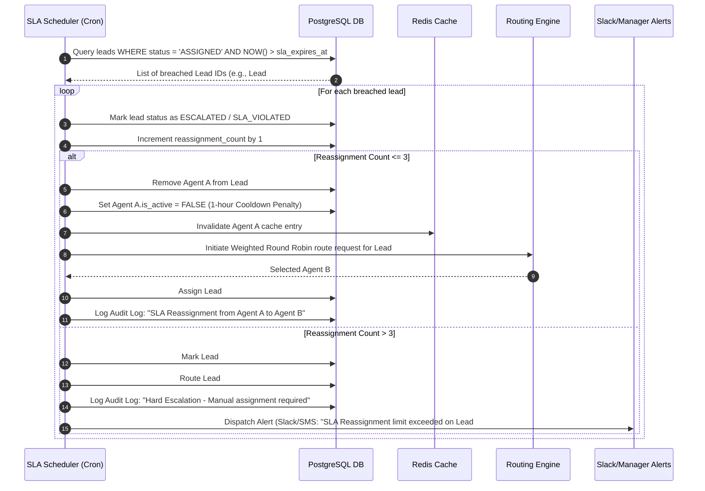

# 06-workflows.md - Process Workflows

This is the Single Source of Truth (SSOT) for lead distribution, SLA monitoring, and escalation processes.

---

## 1. Lead Lifecycle Workflow
This chart tracks the lifecycle transitions of a single lead from initial API ingestion to close.

---

## 2. Follow-Up Lifecycle Workflow
Sales agents must progress leads through contact milestones within configured SLA deadlines.

1. **Assignment Notification:** Immediate WebSocket message or webhook notification is sent to the assigned agent's client terminal upon routing.
2. **First Contact Attempt:** Agent calls or emails the lead. The agent logs this action via the application interface (`PATCH /api/v1/leads/{lead_id}/status`).
3. **Timer Termination:** The system intercepts the status transition. If the status transition occurs before `sla_expires_at`, the SLA is marked as met.
4. **Follow-Up Cadence:** If contact is made, the system requires the agent to log a subsequent activity within 48 hours. If no activity is logged, the lead status defaults back to a warning queue (`Follow-up Required`) for managers to audit.

---

## 3. Escalation Lifecycle Workflow
Detailed sequence for handling SLA breaches and agent penalties.

